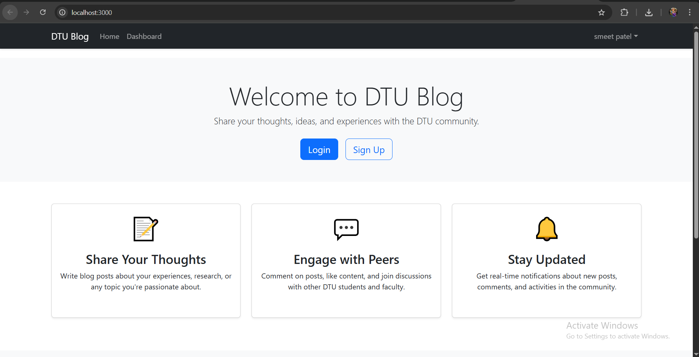
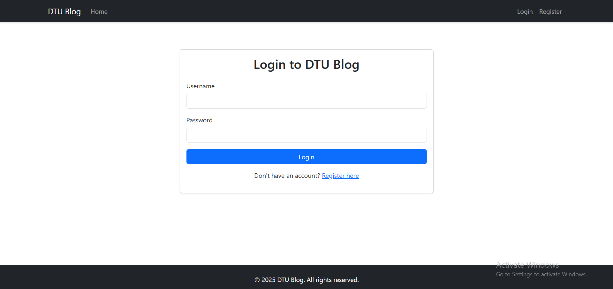
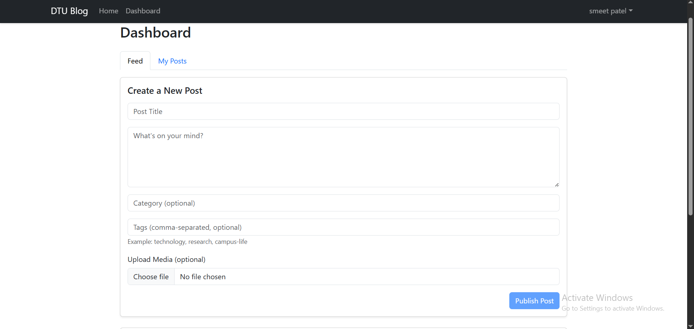
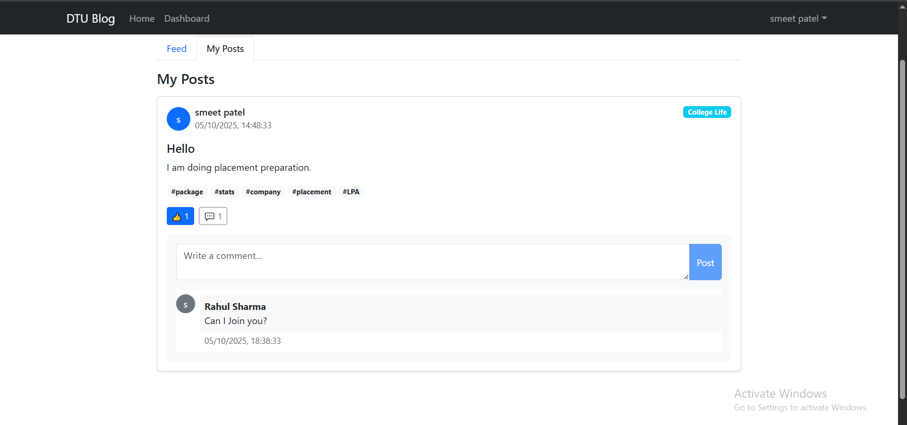

# DTU Blog - A University Community Platform 🚀



A full-stack, feature-rich blogging platform designed for the Delhi Technological University (DTU) community. This application enables students, faculty, and alumni to connect, share knowledge, and engage in meaningful discussions in a dedicated academic environment.


## ✨ Key Features

* **User Authentication:** Secure registration and login system for students and faculty.
* **Create & Manage Posts:** A rich text editor to write, edit, and publish posts with optional categories, tags, and media uploads.
* **Interactive Feed:** A central dashboard to view posts from the entire community.
* **Engage with Content:** Users can like and comment on posts to foster discussion.
* **Real-time Notifications:** Stay updated on new posts, comments, and community activities.
* **Personalized Dashboard:** View and manage your own posts in a dedicated "My Posts" section.

## 💻 Tech Stack

This project is built with a modern MERN-like stack, using Java Spring Boot for the backend.

-   **Frontend:** React.js, Bootstrap, Axios
-   **Backend:** Java 11, Spring Boot, Spring Security, JWT
-   **Database:** MySQL
-   **Build Tools:** Maven (Backend), npm (Frontend)

## Repositories

This project is divided into two separate repositories:

-   🔗 **Frontend Code:** [https://github.com/smeetpatel2530/University-Blogging-Application---frontend](https://github.com/smeetpatel2530/University-Blogging-Application---frontend)
-   🔗 **Backend Code:** [https://github.com/smeetpatel2530/University-Blogging-Application---backend](https://github.com/smeetpatel2530/University-Blogging-Application---backend)
-   🔗 **Video LINK:** [Drive Link](https://drive.google.com/file/d/1IC0P3DJjkhp2IY-hU6gkoOXOXTmyqsnE/view?usp=sharing)

## 📸 Screenshots

| Login Page                               | Home Page                                  |
| ---------------------------------------- | ------------------------------------------ |
|           |              |
| **Post Creation** | **Feed with Comments** |
|          |     |

## 🛠️ Local Setup and Installation

Follow these steps to get the project running on your local machine.

### **1. Prerequisites**

Make sure you have the following software installed:
* **Java 11** or higher
* **Maven**
* **Node.js** and **npm**
* **MySQL** Server

---

### **2. Database Setup**

1.  Start your MySQL server.
2.  Create the database using a MySQL client:
    ```sql
    CREATE DATABASE dtu_blog_db;
    ```
3.  Update the database credentials in the backend's `application.properties` file:
    ```properties
    # backend/src/main/resources/application.properties
    spring.datasource.username=your_mysql_username
    spring.datasource.password=your_mysql_password
    ```

---

### **3. Backend Setup**

1.  Clone the backend repository and navigate into the directory:
    ```bash
    git clone [https://github.com/smeetpatel2530/University-Blogging-Application---backend.git](https://github.com/smeetpatel2530/University-Blogging-Application---backend.git)
    cd University-Blogging-Application---backend
    ```
2.  Build the project and install dependencies:
    ```bash
    mvn clean install
    ```
3.  Run the Spring Boot application:
    ```bash
    mvn spring-boot:run
    ```
    The backend server will start on `http://localhost:8080`.

---

### **4. Frontend Setup**

1.  In a **new terminal window**, clone the frontend repository and navigate into it:
    ```bash
    git clone [https://github.com/smeetpatel2530/University-Blogging-Application---frontend.git](https://github.com/smeetpatel2530/University-Blogging-Application---frontend.git)
    cd University-Blogging-Application---frontend
    ```
2.  Install the required npm packages:
    ```bash
    npm install
    ```
3.  Start the React development server:
    ```bash
    npm start
    ```
    The application will open automatically in your browser at `http://localhost:3000`.

You can now register a new user and start exploring the DTU Blog! 🎉

<br>

<details>
<summary><strong>Common Troubleshooting Tips</strong></summary>

-   **Port Already in Use (8080):** If another service is using port 8080, you can change it in the backend's `application.properties` by adding `server.port=8081`. Remember to update the API proxy URL in the frontend's `package.json` if you do this.
-   **Database Connection Failed:** Double-check that your MySQL server is running and that the username and password in `application.properties` are correct.
-   **CORS Error:** Ensure the backend is running before you start the frontend. The backend is pre-configured to allow requests from `http://localhost:3000`.
</details>

<br>

<details>
<summary><strong>Useful Commands</strong></summary>

#### Backend (Maven)
```bash
# Clean and build the project
mvn clean install

# Run backend tests
mvn test

# Package the application into a .jar file
mvn clean package -DskipTests
